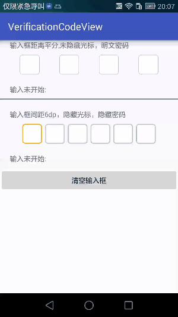

# VerificationCodeView
Android 自定义方形输入框，仿滴滴验证码、小篮单车验证码输入框

## 效果图
## V1.0.1版(上传bintray一直未成功，还在努力)
  

fix bug : [验证码输入错误清空输入框 #7](https://github.com/jiaoyaning/VerificationCodeView/issues/7)  
fix bug : [关于博主手机不好，经常点一次却触发两次`onKey`事件，就设置了一个防止多点击，间隔100毫秒。#6](https://github.com/jiaoyaning/VerificationCodeView/issues/6)  
fix bug : 暗文密码模式无效果  
update : 添加输入框平分等间距模式，并可设置输入框间距  
update ：添加清空输入框方法  
update ：添加文本改变回调  

### 监听
```
public interface OnCodeFinishListener {
        /**
         * 文本改变
         */
        void onTextChange(View view, String content);

        /**
         * 输入完成
         */
        void onComplete(View view, String content);
    }
```

### attr
```
    <!-- 自定义验证码输入框-->
    <declare-styleable name="vericationCodeView">
        <!--输入框的数量-->
        <attr name="vcv_et_number" format="integer" />
        <!--输入类型-->
        <attr name="vcv_et_inputType">
            <enum name="number" value="0" />
            <enum name="numberPassword" value="1" />
            <enum name="text" value="2" />
            <enum name="textPassword" value="3" />
        </attr>
        <!--输入框的宽度-->
        <attr name="vcv_et_width" format="dimension|reference" />
        <!--输入框文字颜色-->
        <attr name="vcv_et_text_color" format="color|reference" />
        <!--输入框文字大小-->
        <attr name="vcv_et_text_size" format="dimension|reference" />
        <!--输入框背景-->
        <attr name="vcv_et_bg" format="reference" />
        <!--光标样式-->
        <attr name="vcv_et_cursor" format="reference" />
        <!--是否隐藏光标-->
        <attr name="vcv_et_cursor_visible" format="boolean" />
        <!--输入框间距，不输入则代表平分-->
        <attr name="vcv_et_spacing" format="dimension|reference" />

    </declare-styleable>
```

#### ———————————一只分割线———————————

## V1.0.0版


GIF被压缩的有点模糊，下面是截图


---
## 用法

```
    <com.jyn.vcview.VerificationCodeView
        android:id="@+id/verificationcodeview"
        android:layout_width="match_parent"
        android:layout_height="wrap_content"
        android:layout_marginTop="30dp"
        android:gravity="center"
        android:orientation="horizontal"
        app:vcv_et_bg="@drawable/et_login_code"
        app:vcv_et_cursor="@drawable/et_cursor"
        app:vcv_et_inputType="number"
        app:vcv_et_number="4"
        app:vcv_et_text_color="@android:color/black"
        app:vcv_et_text_size="6sp" />
```
输入完成监听
```
verificationcodeview.setOnCodeFinishListener(new VerificationCodeView.OnCodeFinishListener() {
            @Override
            public void onComplete(String content) {
                textView.setText(content);
            }
        });
```
所有属性
```
<declare-styleable name="vericationCodeView">
        <!--输入框的数量-->
        <attr name="vcv_et_number" format="integer" />
        <!--输入类型-->
        <attr name="vcv_et_inputType">
            <enum name="number" value="0" />
            <enum name="numberPassword" value="1" />
            <enum name="text" value="2" />
            <enum name="textPassword" value="3" />
        </attr>
        <!--输入框的宽度-->
        <attr name="vcv_et_width" format="dimension|reference" />
        <!--输入框文字颜色-->
        <attr name="vcv_et_text_color" format="color|reference" />
        <!--输入框文字大小-->
        <attr name="vcv_et_text_size" format="dimension|reference" />
        <!--输入框背景-->
        <attr name="vcv_et_bg" format="reference" />
        <!--光标样式-->
        <attr name="vcv_et_cursor" format="reference" />
    </declare-styleable>
```
`vcv_et_bg` 背景示例（默认）
```
<?xml version="1.0" encoding="utf-8"?>
<selector xmlns:android="http://schemas.android.com/apk/res/android">

    <item android:state_window_focused="false">
        <shape android:shape="rectangle">
            <solid android:color="#FFFFFF" />
            <stroke android:width="1dp" android:color="#C4C4C4" />
            <corners android:radius="5dp" />
        </shape>
    </item>

    <item android:state_focused="true">
        <shape android:shape="rectangle">
            <solid android:color="#ffffff" />
            <stroke android:width="1dp" android:color="#0dbc75" />
            <corners android:radius="5dp" />
        </shape>
    </item>
</selector>
```
`vcv_et_cursor` 光标示例（默认）
```
<?xml version="1.0" encoding="utf-8"?>
<shape xmlns:android="http://schemas.android.com/apk/res/android"
    android:shape="rectangle">
    <size android:width="2dp" />
    <solid android:color="#0dbc75" />
</shape>
```


## Gradle
Step 1. Add it in your root build.gradle at the end of repositories:

```
allprojects {
	repositories {
		...
		maven { url 'https://jitpack.io' }
	}
}
```

Step 2. Add the dependency

```
dependencies {
     compile 'com.jyn.verificationcodeview:verificationcodeview:1.0.0'
}
```

## 开发思路
简书：[http://www.jianshu.com/p/781950fe5e73](http://www.jianshu.com/p/781950fe5e73)  
CSDN：[http://blog.csdn.net/jiaoyaning1210/article/details/78427818](http://blog.csdn.net/jiaoyaning1210/article/details/78427818)

---

如果对您有帮助的话，还请给个star，谢谢！

---
